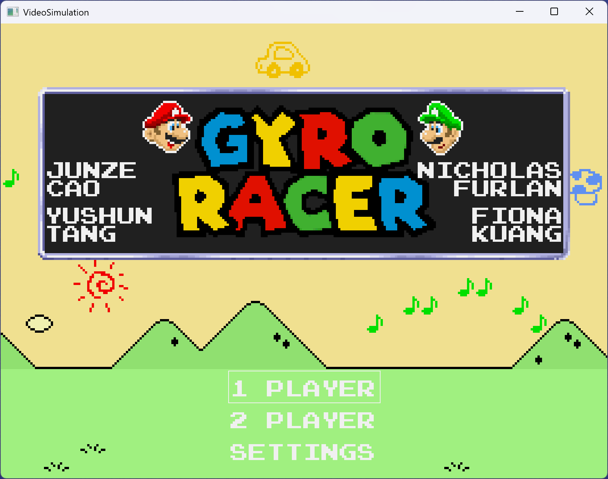
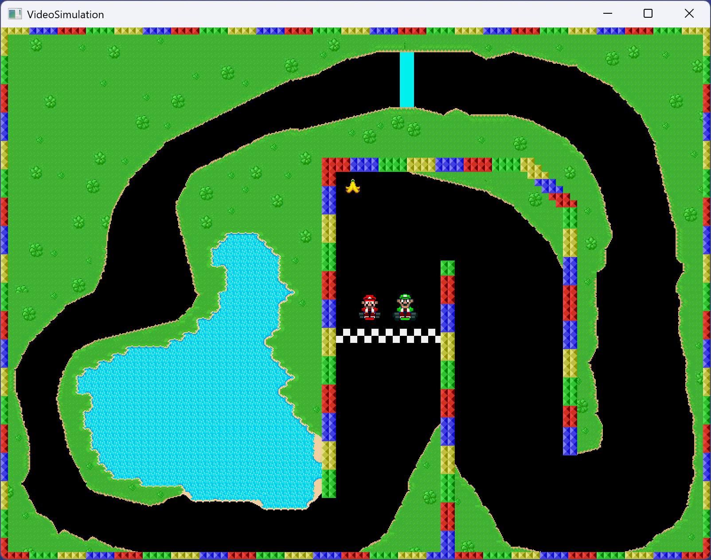
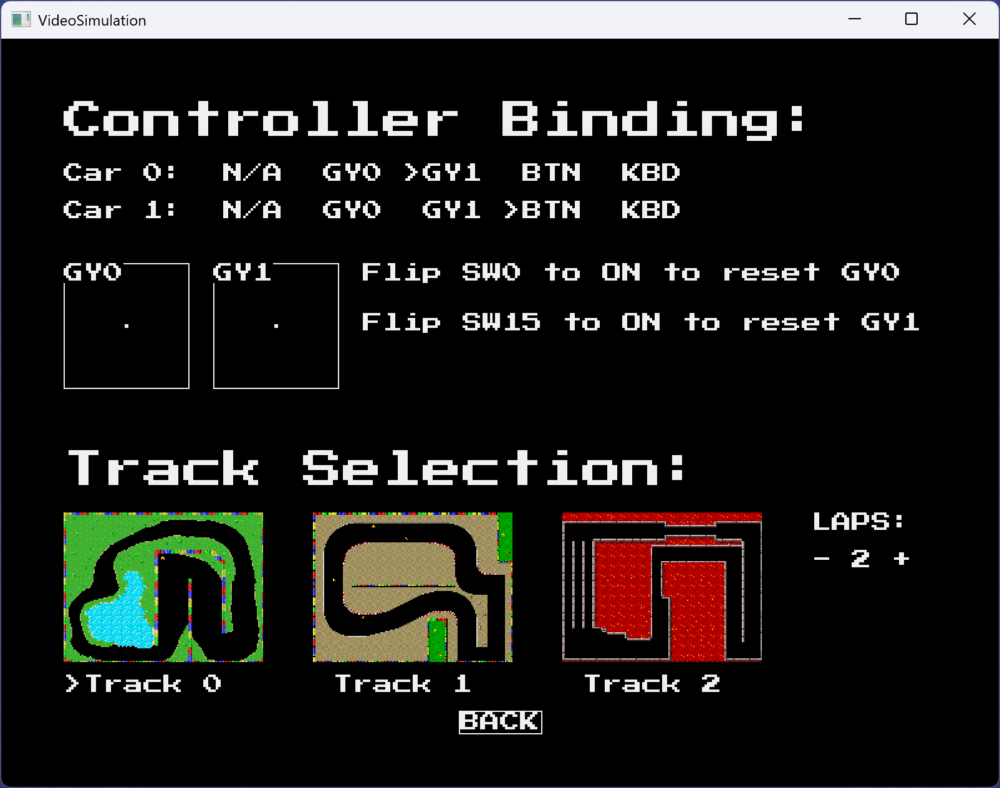
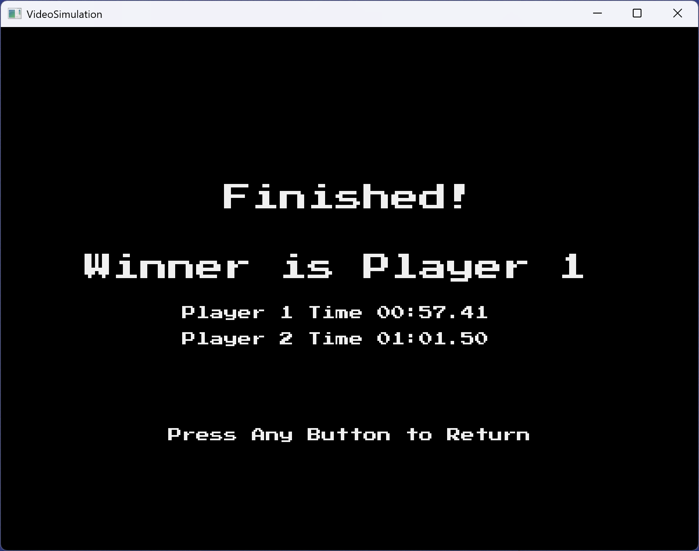

# ECE532 Gyro Racer

This repository contains hardware files (Verilog/VHDL source files) and the software project (C/C++ files) for our ECE532 project.

## Project Description
This is a 2D racing game developed on the Nexys 4 DDR FPGA development board. The game utilizes the PMOD gyroscopes and other input methods to control the racing car, providing an immersive gaming experience.

The game supports both single-player and multiplayer modes. In single-player mode, players compete in a time trial to achieve the best lap time, while in multiplayer mode, players can compete against friends.

## Getting Started
### Hardware Requirements
- Nexys 4 DDR FPGA Development Board
- VGA Monitor
- PMOD GYRO (optional, but the key feature of our game)
- USB Keyboard (optional, alternative controller)

### Setup Instructions
0. Clone this repository to your local machine (you may use `git clone --recursive` to clone all the submodules)
1. (optional) Connect the PMOD GYROs to PMOD connectors JA and JC.
2. (optional) Connect USB keyboard to the USB port.
3. Connect a VGA monitor to the VGA port.
4. Power on the Nexys 4 DDR board.
5. Open Project with Vivado 2018.3, run synthesis, implementation, generate bitstream, export hardware, use the generated bitstream to program your board.
6. Launch Xilinx SDK, create a new C++ empty project with BSP package.
7. Copy all files from `software/` to the C++ project.
8. Create a new Run Configuration, Compile and Run in Xilinx SDK.

### How to Play
- In the title screen and settings interface, the on-board buttons can be used for selection
- Select between single-player time trial and multiplayer mode at the title screen
- In the settings interface, you can:
  - Choose your preferred controller (PMOD Gyroscope, on-board buttons, or keyboard)
  - Select the race track
  - Set the number of laps for the race
- In the game, use the specified controller to control the racing car
- Try to complete the race track in the shortest time possible

## Design Tree
```
ece532_gyro_racer/
├── assets/
│   ├── output/ [Header files generated from images]
│   ├── resource/ [Images for characters/tracks/fonts]
│   ├── mp3_conv.py
│   ├── picture_to_header.py
│   ├── tree.py
│   └── wav_to_hex.py
├── docs/ [Documentation of the project]
├── final/
│   └── gyro_racer_proj/ [Root directory for Vivado Project]
│       ├── gyro_racer.ip_user_files/ [IP user files generated by Vivado]
│       ├── gyro_racer.srcs/
│       │   ├── constrs_1/imports/libs/Nexys-4-DDR-Master.xdc
│       │   └── sources_1/
│       │       ├── bd/
│       │       │   ├── design_1/ [block design <design_1> files]
│       │       │   └── mref/ [block design reference files]
│       │       ├── imports/
│       │       │   ├── audio_module/ [Verilog files for custom Audio Generator IP]
│       │       │   │   ├── axis_acker8k.v
│       │       │   │   └── pwm_generator.v
│       │       │   ├── gyro_reader_0325/ [Verilog files for custom Gyroscope Calculation IP]
│       │       │   │   ├── axes.v
│       │       │   │   ├── gyro_reader_v1_0.v
│       │       │   │   └── gyro_reader_v1_0_S00_AXI.v
│       │       │   ├── pmod_gyro/ [VHDL files for 3rd-party pmod_gyro interface IP]
│       │       │   │   ├── pmod_gyro_l3g4200d.vhd
│       │       │   │   └── spi_master.vhd
│       │       │   └── sprite_controller/ [Verilog files for custom Sprite Controller IP]
│       │       │       ├── ctrl.v
│       │       │       ├── sprite_controller.v
│       │       │       ├── sprite_reader.v
│       │       │       └── sprite_writer.v
│       │       └── new/vid_to_vga_mixer.v [Verilog files for custom fore/background overlay IP]
│       └── gyro_racer.xpr
├── ip/
│   ├── ip_repo/gyro_reader_1.0/ [IP repository for custom IP]
│   ├── ip_user_files/
│   └── managed_ip_project/ [edit IP project files]
├── ip_keyboard/axi_ps2_1.0/ [IP repository files for digilent PS/2 IP]
├── software/
│   ├── game/ [Game Logic]
│   │   ├── data/
│   │   │   ├── bgm.h
│   │   │   ├── luigi__combined.h
│   │   │   ├── map_0.h
│   │   │   ├── map_1.h
│   │   │   ├── map_2.h
│   │   │   ├── mario__combined.h
│   │   │   └── title.h
│   │   ├── car.hpp
│   │   ├── controller.hpp
│   │   ├── game.hpp
│   │   ├── gameend.hpp
│   │   ├── gameoption.hpp
│   │   ├── gameplay.hpp
│   │   ├── gameplaystate.hpp
│   │   ├── gamestart.hpp
│   │   └── map.hpp
│   ├── graphics/ [Graphics Library]
│   │   ├── color/
│   │   │   ├── color.cpp
│   │   │   └── color.hpp
│   │   ├── display/
│   │   │   ├── display.cpp
│   │   │   └── display.hpp
│   │   ├── draw/
│   │   │   ├── draw.cpp
│   │   │   └── draw.hpp
│   │   ├── font/
│   │   │   ├── font.cpp
│   │   │   └── font.hpp
│   │   ├── image/
│   │   │   ├── image.cpp
│   │   │   └── image.hpp
│   │   └── resource/font_map.hpp
│   ├── memory/ [Memory Library, use TLSF as memory pool]
│   │   ├── tlsf/ [Referenced open-source implementation of memory pool]
│   │   ├── memory.cpp
│   │   └── memory.hpp
│   ├── platform/ [Platform-dependent classes for interfacing devices]
│   │   ├── microblaze/
│   │   │   ├── adma.hpp
│   │   │   ├── button_switch.cpp
│   │   │   ├── button_switch.hpp
│   │   │   ├── gyro.hpp
│   │   │   ├── intc.cpp
│   │   │   ├── intc.hpp
│   │   │   ├── keyboard.hpp
│   │   │   ├── sprite_engine.hpp
│   │   │   ├── timer.hpp
│   │   │   └── vdma.hpp
│   │   ├── disp_man.hpp
│   │   └── fwd.hpp
│   ├── README.txt
│   ├── lscript.ld
│   └── main.cc
├── stash/ [Temporary files during development]
├── README.md
└── tree.txt
```

### Explanation
The design tree structure is organized into the following parts:

- `assets/`: Resource files (track image, BGM, font, ...) and utility python scripts for converting binary files (image, music) to C/C++ header.

- `docs/`: Final project report, presentation slides, and resources referenced in this Markdown document.

- `final/gyro_racer_proj/`: The Vivado 2018.3 project directory.
    - `gyro_racer.srcs/sources_1/`: The RTL code for all custom IPs and the 3rd-party dependencies.
    - `gyro_racer.srcs/constrs_1/`: The constraint file used in the project.

- `ip/`: The packaged IP location

- `ip_keyboard/`: The AXI PS/2 IP from Digilent Inc. for keyboard interfacing.

- `software/`: The software C++ files for this project.

- `stash/`: The temporary files used during development, which can be safely ignored.

See `tree.txt` for the generated version of the design tree.

## Screenshots and Video

Watch our project demo video [here](https://youtu.be/LTuoZn6Tse0?feature=shared)!

The following screenshots are taken from the PC video simulation environment, which accurately represents how the game looks on the FPGA board.
The simulation uses the same graphics library as the FPGA implementation, ensuring that what you see in simulation is exactly what you'll get on the actual hardware.


*Title Screen with game options*


*Gameplay with Mario and Luigi characters, using Track 0*


*Settings interface for controller and track selection*


*End screen showing the race completion time results*

# Acknowledgements
- This project uses [Press Start 2P](https://fonts.google.com/specimen/Press+Start+2P) as its default font.
- This project uses [TLSF](http://www.gii.upv.es/tlsf/) as its memory pool for dynamic memory allocation.
- The video part is developed according to [this tutorial](https://numato.com/kb/simple-hdmi-vga-framebuffer-design-example-on-neso-artix-7-fpga-board/).
